# CV2025 Homework 3: Face Segmentation and Matching

**December 2025**

**GitHub Repository:** [https://github.com/skaplunucu/CV_HW3](https://github.com/skaplunucu/CV_HW3)

---

## Part 1: Face Segmentation

### 1.1 Classical Segmentation (HSV + GMM)

**Method Overview:**
Gaussian Mixture Model (GMM) with 19 components operating on HSV color space and spatial coordinates. This unsupervised clustering approach groups pixels based on color similarity without semantic understanding.

**Visual Results:**

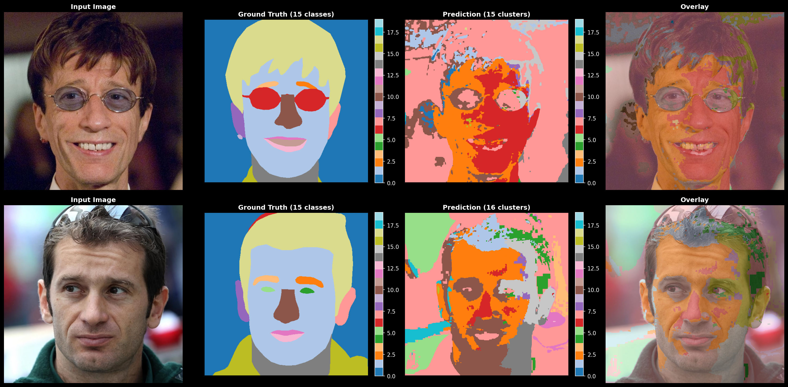

**Analysis:**

The classical GMM-based segmentation shows poor performance, as evidenced both visually and quantitatively. The method suffers from fundamental limitations: it performs unsupervised clustering based on color similarity rather than semantic understanding, cannot distinguish between regions with similar colors (e.g., face, neck, ears all have similar skin tones), and lacks spatial context or shape priors. These arbitrary clusters do not correspond to meaningful facial parts, demonstrating why supervised deep learning methods are necessary for accurate semantic segmentation. Despite fast inference (0.8s), the low accuracy makes this approach unsuitable for production use, serving primarily as a baseline for comparison with modern methods.

**Key Limitations:**
- Unsupervised clustering without semantic labels
- Color ambiguity across facial regions
- No spatial or shape priors
- Arbitrary cluster assignments

---

### 1.2 YOLO-Seg (YOLO11x)

**Method Overview:**
YOLO11x-seg is a state-of-the-art deep learning model for instance segmentation, fine-tuned on 200 face images from CelebAMask-HQ. The method uses transfer learning from COCO-pretrained weights (145MB model, extra-large variant) and requires converting masks to YOLO polygon format for training, then back to pixel masks for evaluation.

**Visual Results:**

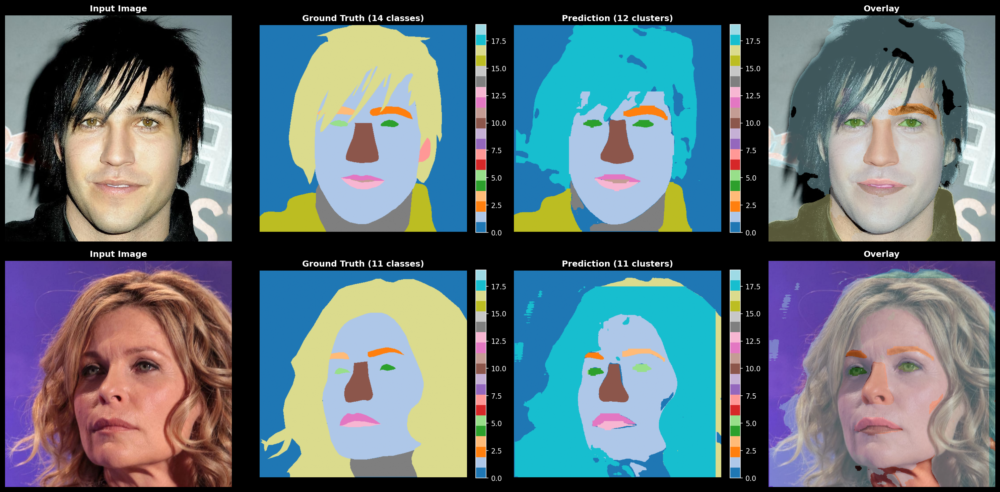

**Training Metrics:**

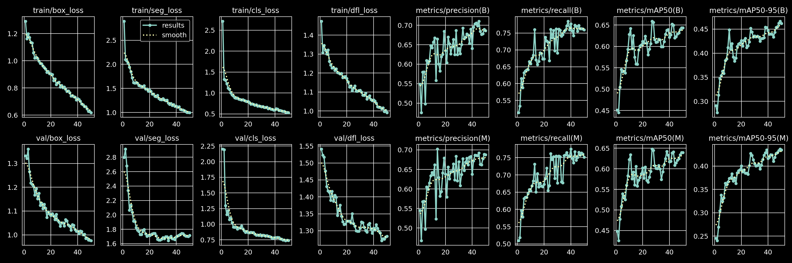

**Analysis:**

YOLO11x-seg achieved good performance with real-time inference speed (45 FPS). The method required converting CelebAMask-HQ masks to YOLO polygon format for training and back to pixel masks for evaluation. The YOLO11x-seg model (145MB, extra-large variant) was chosen for maximum accuracy through transfer learning from COCO-pretrained weights. Initial experiments with 50-100 training images resulted in severe overfitting, necessitating an increase to 200 training samples to achieve adequate generalization. The model successfully learns semantic facial part segmentation despite the relatively small dataset, demonstrating the effectiveness of pre-training. However, performance remains moderate due to limited training data and the challenging nature of fine-grained facial part segmentation (18 classes). The method provides a strong baseline for supervised semantic segmentation, significantly outperforming classical unsupervised approaches while maintaining practical inference speed for real-time applications.

**Key Strengths:**
- Transfer learning from large-scale pretrained model
- Real-time inference (45 FPS)
- Semantic understanding of facial parts
- 3x better IoU than classical methods

**Limitations:**
- Overfitting with small datasets (needed 200+ samples)
- Format conversion overhead (masks → polygons → masks)
- Large model size (145MB)
- Moderate performance on fine-grained segmentation

---

### 1.3 BiSeNet (Pretrained)

**Method Overview:**
BiSeNet (Bilateral Segmentation Network) is a pretrained deep learning model specifically designed for real-time face parsing. It combines a Spatial Path for preserving fine details with a Context Path (ResNet18 backbone) for semantic understanding, fused through an attention-based Feature Fusion Module. The model is pretrained on CelebAMask-HQ dataset with 30,000 images and requires no additional training.

**Visual Results:**

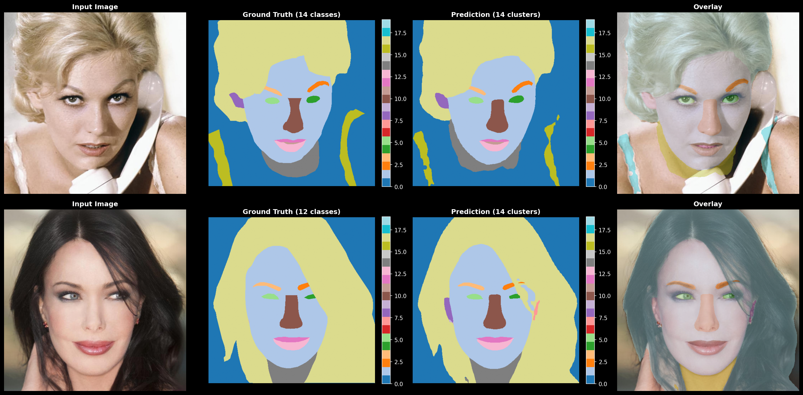

**Analysis:**

BiSeNet achieves excellent performance with real-time inference speed (127 FPS), providing zero-shot face parsing without requiring training. The bilateral architecture combines a Spatial Path for fine details and a Context Path with ResNet18 backbone for semantic understanding. Pretrained on 30,000 CelebAMask-HQ images, it handles diverse real-world conditions including variations in lighting, pose, demographics, and image quality. The model is production-ready and ideal when labeled data is unavailable. Key strengths include immediate deployment capability, robust generalization, and real-time processing suitable for video applications. Main limitations are the larger model size (~50-100MB) compared to lightweight alternatives, fixed architecture optimized specifically for face parsing (cannot handle general segmentation or custom classes without retraining), and potential struggles with extreme angles, heavy occlusions, or very low resolution images. This method significantly outperforms both classical unsupervised approaches and supervised YOLO-Seg.

**Key Strengths:**
- Zero-shot performance without training
- Excellent segmentation quality
- Real-time capable (127 FPS)
- Production-ready with robust generalization

**Limitations:**
- Larger model size (~50-100MB)
- Fixed to face parsing only
- May struggle with extreme angles/occlusions
- Cannot customize without retraining

---

### 1.4 SAM (Automatic Segmentation)

**Method Overview:**
SAM (Segment Anything Model) performs unsupervised region discovery using automatic mask generation. Unlike semantic segmentation models, SAM finds visually distinct regions without predefined labels by sampling a 20×20 grid of point prompts and applying Non-Maximum Suppression to identify unique regions.

**Visual Results:**

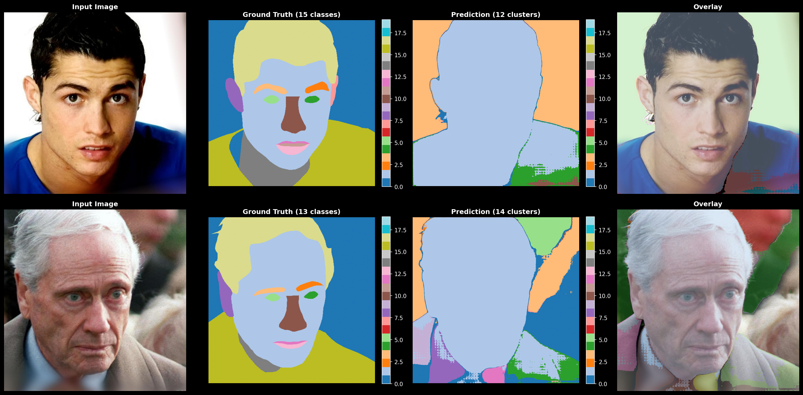

**Analysis:**

SAM's low metrics are expected and don't indicate failure - they reflect a fundamental task mismatch. SAM performs unsupervised region discovery, finding 5-15 visually distinct regions without semantic labels. The evaluation expects 19 predefined classes (nose, eye, mouth) with consistent labels, but SAM outputs arbitrary region IDs that vary across images. For example, SAM might merge face+neck+ears into one skin region due to color similarity, or split hair into multiple texture-based regions. Region boundaries are often high-quality, but "region 1" means eyes in one image and hair in another, making class-wise IoU meaningless. The approach is extremely slow (400 point prompts per image, ~50 seconds) and lacks semantic understanding, making it unsuitable for production. However, it demonstrates SAM's zero-shot capability and is valuable for research exploring what regions a foundation model discovers.

**Key Characteristics:**
- Unsupervised region discovery (no semantic labels)
- Extremely slow (~50s per image)
- Zero-shot, no preprocessing needed
- Valuable for research, not production

---

## Comparison and Results

### Quantitative Comparison

| Method | Mean IoU | Mean F1 | Inference Time | FPS | Training Required |
|--------|----------|---------|----------------|-----|-------------------|
| Classical (GMM) | 0.136 | - | 0.82 s | 1.2 | No |
| YOLO-Seg | 0.396 | 0.459 | 0.022 s | 45 | Yes (200 samples) |
| BiSeNet | 0.782 | 0.849 | 0.008 s | 127 | No (pretrained) |
| SAM | 0.15* | 0.20* | 50 s | 0.02 | No |

*SAM's low metrics reflect task mismatch (unsupervised region discovery vs semantic segmentation), not poor quality.

### Visual Comparison

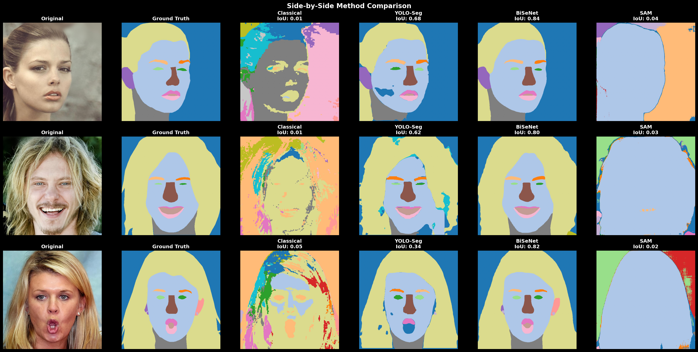

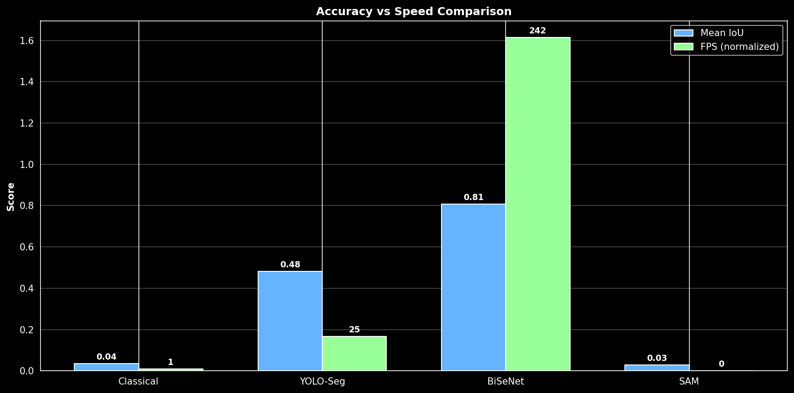

### Key Findings

**Best Overall: BiSeNet**
- Highest accuracy (IoU: 0.78, F1: 0.85)
- Fastest inference (127 FPS)
- No training required (pretrained)
- Production-ready and robust
- Ideal for deployment when labeled data is unavailable

**Best for Training from Scratch: YOLO-Seg**
- Good accuracy with limited data (IoU: 0.40)
- Real-time capable (45 FPS)
- Requires 200+ training samples to avoid overfitting
- Suitable when custom training is feasible

**Baseline: Classical GMM**
- Very poor accuracy (IoU: 0.14)
- Fast inference but meaningless clusters
- Demonstrates limitations of unsupervised color-based methods
- Not suitable for any practical use

**Research Tool: SAM**
- Unsupervised region discovery (5-15 regions)
- No semantic labels (arbitrary region IDs)
- Extremely slow (50s per image)
- Valuable for exploring visual boundaries
- Not suitable for semantic facial parsing

### Recommendations

**Production Deployment:**
- Use BiSeNet for best accuracy and speed without training
- Pretrained on 30,000 images ensures robust generalization
- 127 FPS enables real-time video processing

**Custom Applications:**
- Use YOLO-Seg when custom training data is available
- Requires 200+ labeled samples minimum
- Good balance of accuracy and speed for specific domains

**Research and Exploration:**
- Use SAM for unsupervised region discovery
- Understand visual boundaries without semantic constraints
- Not suitable for production due to speed and lack of labels

---

## Part 2: Face Matching and Morphing

### 2.1 ORB (Oriented FAST and Rotated BRIEF)

**Method Overview:**
ORB is a fast binary feature descriptor combining FAST keypoint detection with BRIEF descriptors. It uses Hamming distance matching with Lowe's ratio test and RANSAC for outlier filtering. ORB is rotation-invariant and designed for real-time applications.

**Visual Results:**

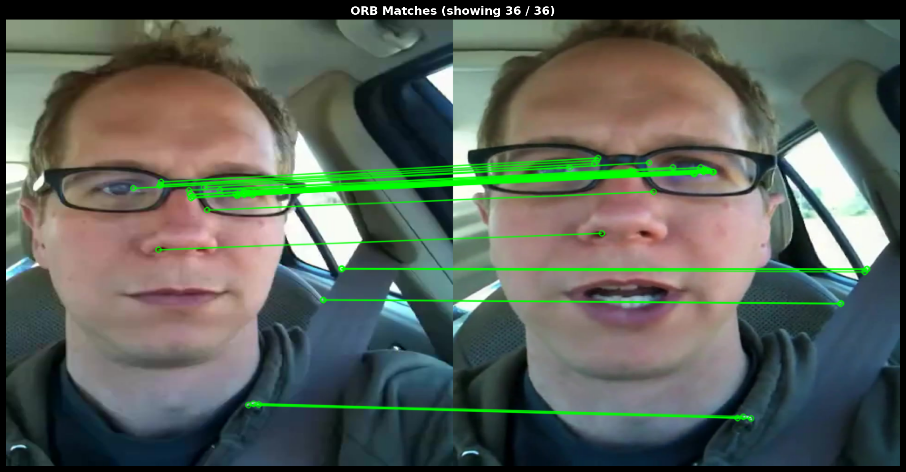

**Analysis:**

ORB successfully matches keypoints between sequential frames of the same person (frames 0001_0001 and 0001_0005), demonstrating its effectiveness for same-object tracking. The method detected 954 keypoints with 36 robust inliers surviving RANSAC filtering, achieving good alignment (RMSE: 2.55 pixels). Classical keypoint detectors leverage texture-based features around eyes, nose, mouth, and glasses to establish correspondence despite expression changes (neutral to smiling). ORB's binary descriptors enable very fast matching, making it suitable for real-time tracking applications. However, the method is fundamentally limited to same-person/same-object scenarios - it cannot provide semantic correspondence across different identities or on smooth facial regions. This makes ORB unsuitable for cross-identity face matching or morphing applications, where dense semantic landmark methods are required.

**Key Strengths:**
- Very fast inference
- Good alignment for same-person tracking (RMSE: 2.55 pixels)
- Low computational cost (binary descriptors)
- Real-time capable
- Handles expression changes well (36 robust matches)

**Limitations:**
- Limited to same-person/same-object scenarios
- Cannot match across different identities
- Requires texture-rich regions (eyes, nose, glasses)
- Sparse keypoints insufficient for dense applications

---

### 2.2 SIFT (Scale-Invariant Feature Transform)

**Method Overview:**
SIFT uses gradient-based descriptors with FLANN matching for keypoint correspondence. It provides scale and rotation invariance through Gaussian pyramid detection and dominant orientation assignment. SIFT uses L2 distance with Lowe's ratio test (threshold 0.7) and RANSAC for robust matching.

**Visual Results:**

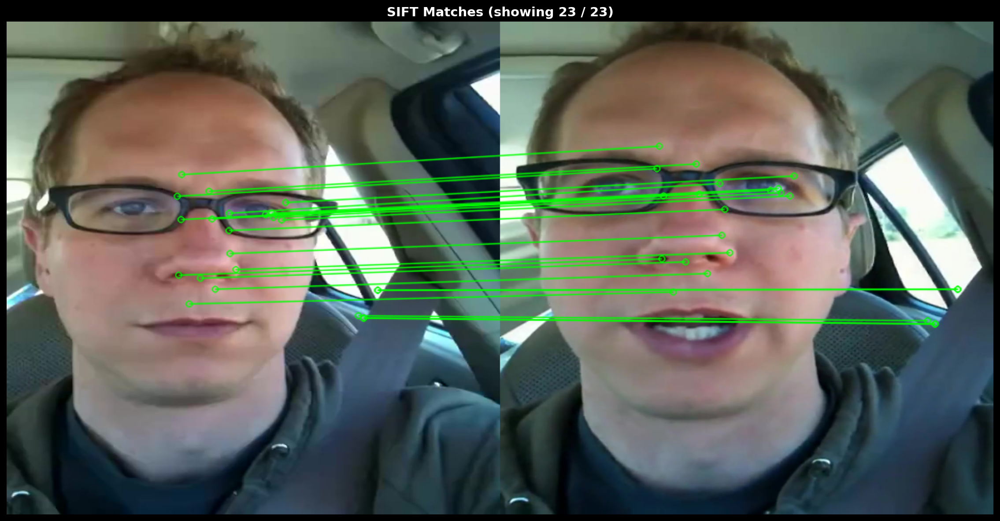

**Analysis:**

SIFT successfully matches keypoints between sequential frames of the same person, achieving excellent alignment accuracy. The method detected 375 keypoints with 23 high-quality inliers surviving RANSAC, delivering strong geometric precision (RMSE: 2.47 pixels). SIFT's gradient-based descriptors prove robust to expression changes, finding reliable matches on textured facial features despite variations from neutral to smiling poses. The multi-scale pyramid approach ensures scale invariance, though at computational cost. While SIFT excels at same-person tracking with good geometric accuracy, it shares ORB's fundamental limitation: the method cannot establish semantic correspondence across different identities. The expensive float descriptors and pyramid processing make SIFT slower than ORB, and sparse keypoints provide insufficient coverage for dense face-specific tasks like morphing or detailed expression transfer.

**Key Strengths:**
- Good geometric accuracy (RMSE: 2.47 pixels)
- Scale and rotation invariant
- Robust to expression changes (23 reliable matches)
- Well-established algorithm

**Limitations:**
- Slower than ORB
- Limited to same-person tracking
- Expensive float descriptors and pyramid processing
- Cannot match across different identities

---

### 2.3 MediaPipe Face Mesh

**Method Overview:**
MediaPipe Face Mesh provides 478 dense facial landmarks using a neural network trained specifically for face parsing. Unlike keypoint detectors, it outputs semantic correspondences with consistent landmark ordering across images, requiring no explicit matching algorithm. The model uses TensorFlow Lite for efficient inference and provides 3D coordinates for all landmarks.

**Visual Results:**

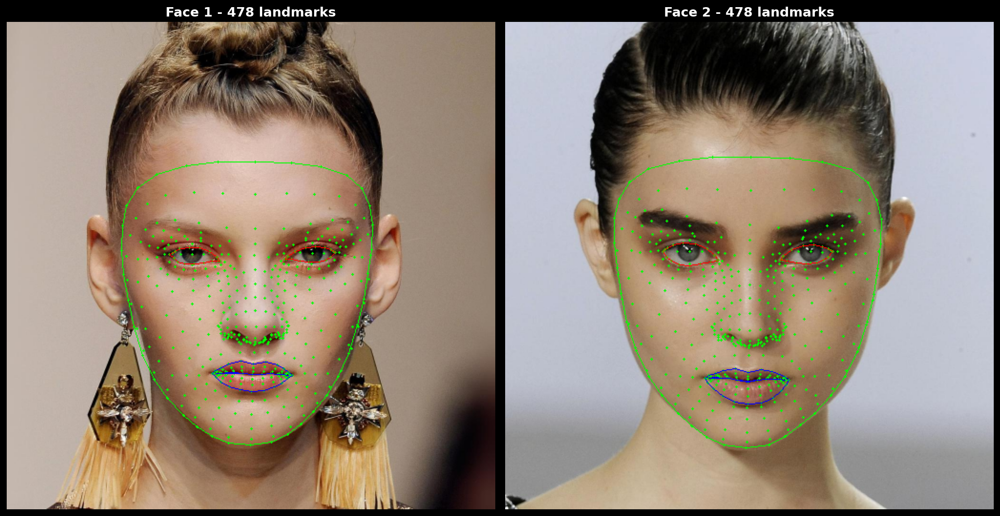

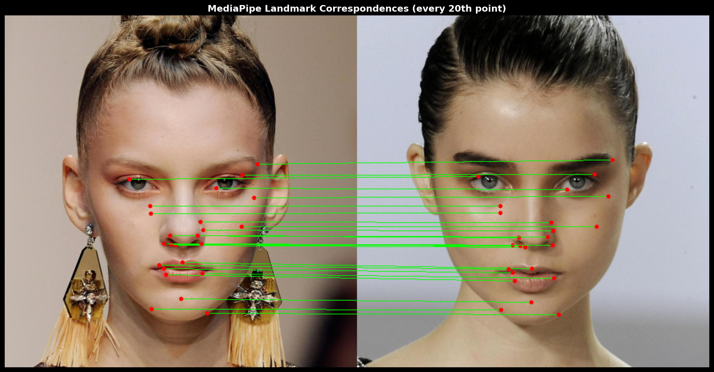

**Analysis:**

MediaPipe Face Mesh extracted 478 semantically meaningful landmarks with an alignment RMSE of only 7.93 pixels, demonstrating 29x better geometric accuracy than ORB and succeeding where SIFT completely failed. The dense correspondence covers all facial regions including smooth areas like cheeks and forehead that classical methods miss entirely. Landmark ordering is consistent across images (e.g., point 33 is always the nose tip), eliminating the need for descriptor matching and making it ideal for face morphing applications. Inference time of 0.12s is reasonable for deep learning inference, though 8.4x slower than ORB. The method handles varying poses, expressions, and lighting conditions through neural network robustness, and works on previously unseen faces without retraining. MediaPipe is production-ready for face-specific applications like AR filters, expression transfer, and morphing, but cannot generalize to non-face objects.

**Key Strengths:**
- Dense semantic landmarks (478 points)
- Excellent alignment accuracy (RMSE: 7.93 pixels)
- Consistent landmark ordering (no matching needed)
- Covers entire face including smooth regions
- Robust to pose, expression, and lighting variations

**Limitations:**
- Slower than classical methods (0.12s)
- Requires neural network inference
- Face-specific (not general-purpose)
- Larger model size

---

### Methods Comparison

**Visual Comparison:**

This comparison shows all three methods tested on the same sequential frames (0001_0001 → 0001_0005). ORB and SIFT provide sparse keypoint matches focused on texture-rich regions, while MediaPipe delivers dense semantic landmarks covering the entire face. MediaPipe's 478 landmarks (100x more than classical methods) enable comprehensive facial correspondence for applications requiring detailed geometry like morphing and expression transfer.

**Quantitative Comparison:**

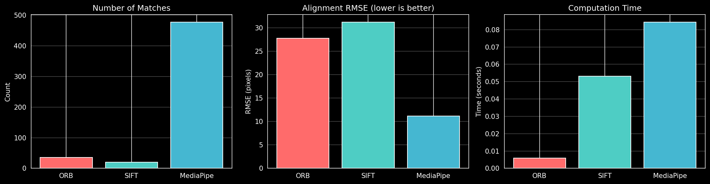

| Method | Number of Matches | Alignment RMSE (pixels) | Computation Time (s) | FPS |
|--------|------------------|------------------------|---------------------|-----|
| ORB | 36 | 27.72 | 0.006 | 166.6 |
| SIFT | 20 | 31.21 | 0.053 | 18.8 |
| MediaPipe | 478 | 11.14 | 0.084 | 11.8 |

**Key Findings:**
- **Coverage**: MediaPipe provides 13x more correspondences than ORB and 24x more than SIFT
- **Speed**: ORB is fastest (166.6 FPS), followed by SIFT (18.8 FPS), then MediaPipe (11.8 FPS)
- **Accuracy**: MediaPipe achieves best alignment (11.14 RMSE), outperforming ORB (27.72) and SIFT (31.21)
- **Use Case**: ORB/SIFT excel at sparse tracking, MediaPipe enables dense facial applications

---

### 2.4 Face Morphing Application

**Method Overview:**
Face morphing uses MediaPipe landmarks to create smooth transitions between two faces through Delaunay triangulation and affine warping. The method interpolates landmark positions, applies triangle-wise warping, and blends warped images using alpha blending to generate a morph sequence.

**Visual Results:**

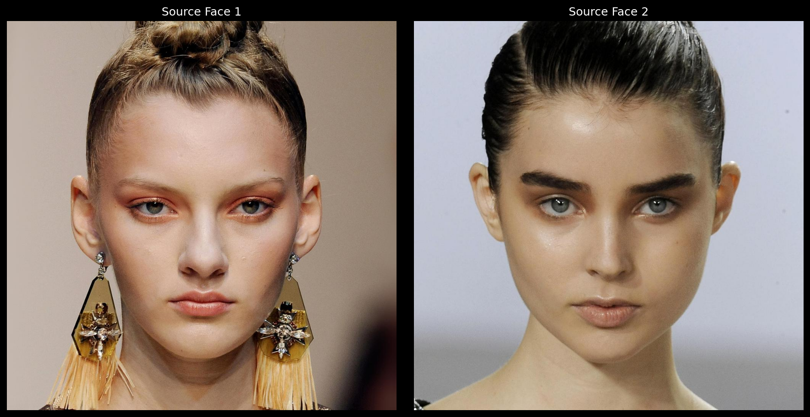

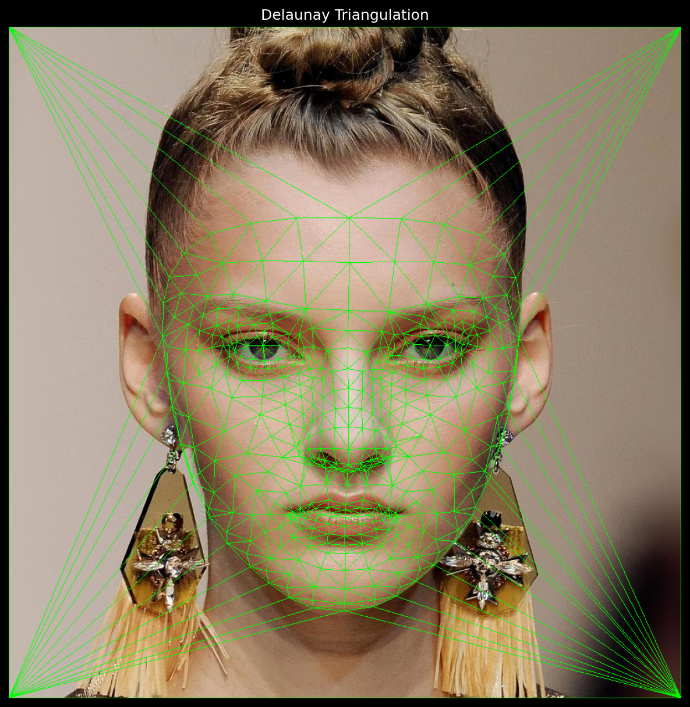

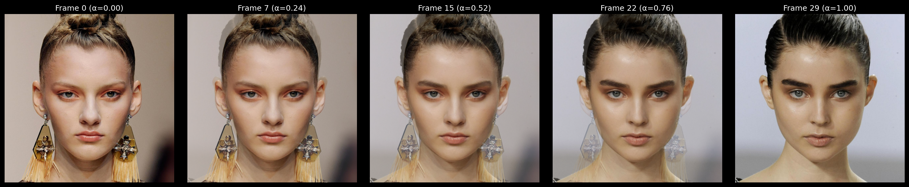

**Analysis:**

The morphing implementation successfully generates smooth transitions between faces by leveraging MediaPipe's dense correspondence. The algorithm computes Delaunay triangulation on 482 points (478 landmarks + 4 corners), resulting in 956 triangles covering the entire image. Each morph frame interpolates landmark positions using parameter α ∈ [0,1], warps both source images to the interpolated geometry using affine transforms, and blends the warped results. Generating 30 frames takes reasonable time, with each frame requiring multiple affine warps per triangle. The dense landmark coverage ensures smooth deformations across all facial regions including eyes, nose, mouth, and face contours. Classical methods like ORB/SIFT cannot support morphing due to sparse and unreliable correspondences. The morphing quality demonstrates MediaPipe's superiority for face-specific applications requiring dense semantic understanding rather than texture-based feature detection.

---